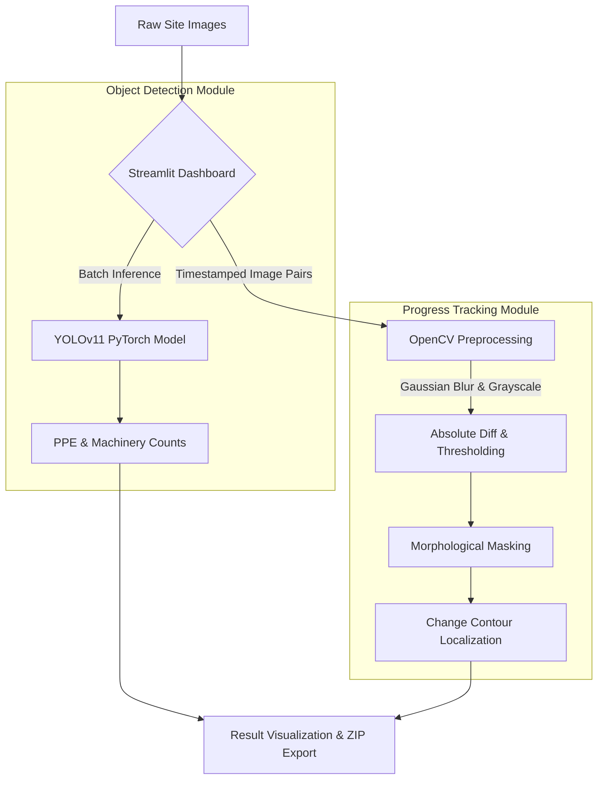
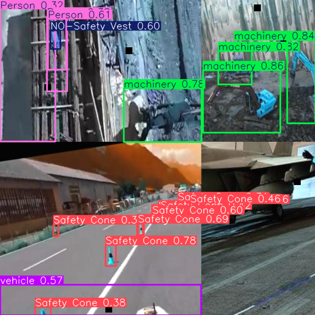

# SiteSpectra: Construction Reality Intelligence Pipeline

SiteSpectra is an end-to-end computer vision pipeline designed for modern construction monitoring. It combines deep learning-based object detection (YOLOv11) with classical computer vision frame-differencing to automate site safety compliance and quantify structural progress across time.

This project was built to simulate a lightweight construction monitoring pipeline, mirroring the reality-capture workflows used by industry leaders like Track3D.

## 🏗️ Core Features
- **Site Entity & Safety Detection:** Detects workers, machinery, and PPE compliance in real-time. Identifies specific hazard classes like `NO-Hardhat` or `NO-Safety Vest`.
- **Structural Progress Tracking:** Quantifies visual site changes by computing the structural difference between timestamped before/after images.
- **Interactive Dashboard:** A Streamlit-based UI for real-time inference, batch image processing, and result exportation.

## ⚙️ Architecture & Pipeline Flow

The project is structured as a multi-stage vision pipeline rather than a single notebook demo. 



## 📸 Sample Outputs

*(Note: Replace these placeholders with the best results from the 17 images you downloaded!)*

### Object & Safety Detection

*Figure 1: YOLOv11 successfully identifying workers and PPE compliance.*

### Progress Comparison (Before / After)

*Figure 2: OpenCV pipeline highlighting new structural additions in red.*

## 🚀 Getting Started

### 1. Install Dependencies
```bash
pip install -r requirements.txt
```

### 2. Launch the Pipeline
```bash
streamlit run app.py
```

### 3. Model Training (Optional)
The model was fine-tuned on the Construction Site Safety Dataset (2,800+ images) for 20 epochs. To run training on a custom dataset:
```bash
python train.py
```
*(A detailed Google Colab training guide is available in the project documentation).*

## 🔮 Future Work
- Integration with 3D BIM models for spatial progress mapping.
- Extend pipeline with an optional COLMAP module for multi-view 3D scene reconstruction.
- Implement instance segmentation for specific structural elements (e.g., scaffolding, rebar).
